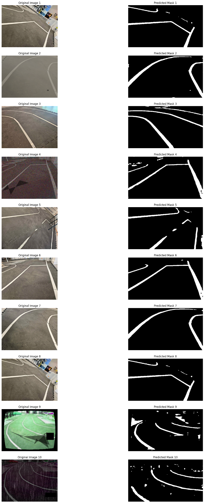

# simple_LaneNet
# OptimizedLaneNet — Lightweight Real-time Lane Segmentation

## Model Overview
- **Backbone**: Depthwise Separable Convolutions  
- **Attention**: SE Block (reduction=8)  
- **Residual Blocks**: 2 stages  
- **Decoder**: Bilinear upsampling + conv layers  
- **Input**: 270×480 RGB  
- **Output**: 270×480 binary lane mask  

## Performance
- **Latency (End-to-End, pre+infer+post, batch=1)**: **25.05 ms/image (≈ 39.9 FPS)**  
- **Pure Inference (forward only, batch=1)**: **1.88 ms/image (≈ 532 FPS)**  
- **Model size**: ~1 MB (PyTorch)  

